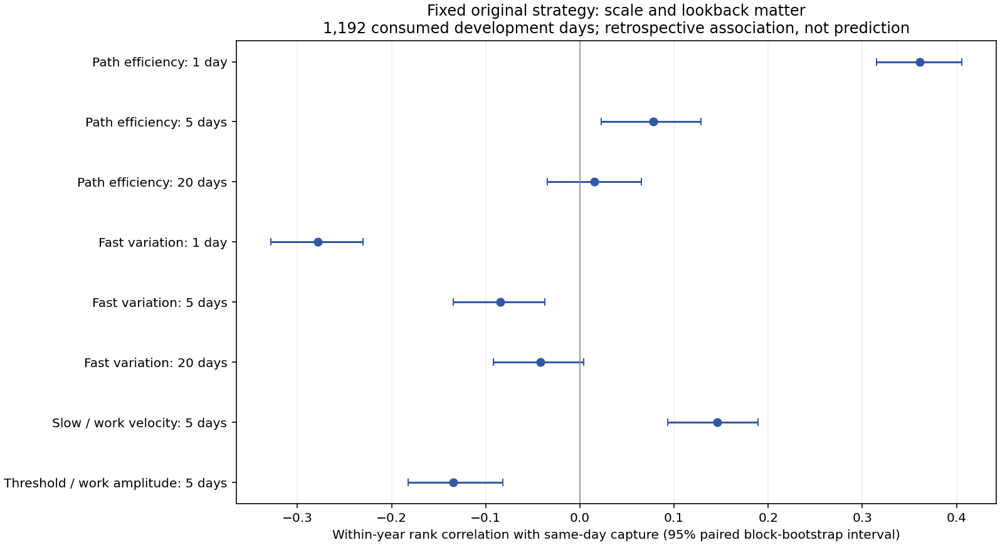
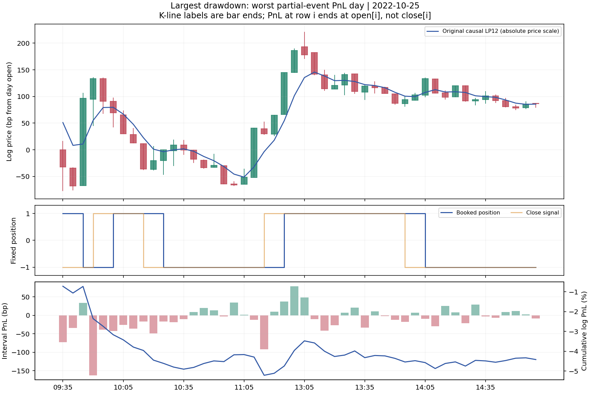
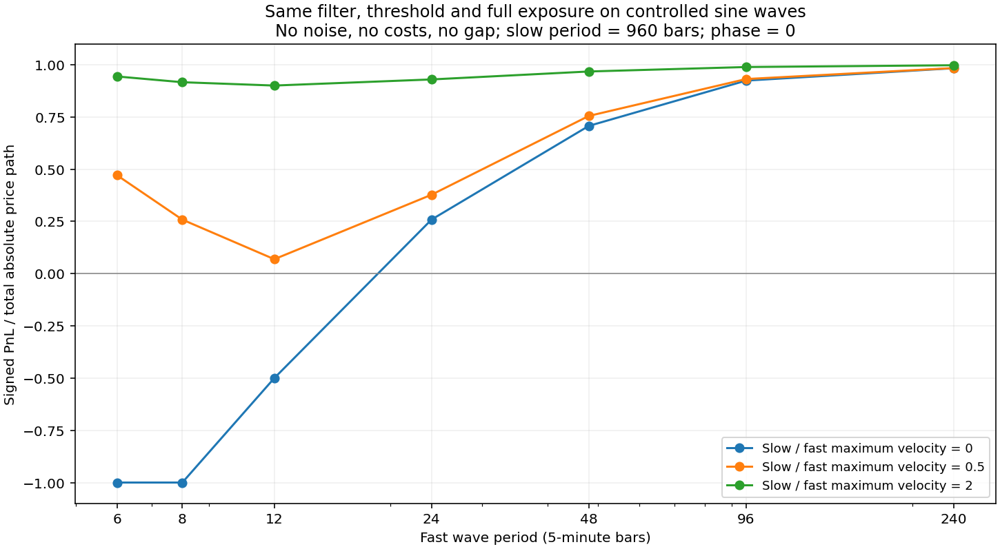

# 固定原策略：持续回撤的跨尺度价格根因

本轮找到了一组可重复的**价格路径—固定算法失配关系**：日内往返多、净推进少，短周期成分相对强，且滞回门槛相对工作波幅大时，策略容易在转折后才反手，盈利机会不足以覆盖退出前的回吐。**“低频越强越坏”没有获得支持；慢频段相对更强，整体与更好的收益捕获率相关。**

这解释了持续磨损类回撤的一大部分，不能包办全部事件。强趋势中的短促反向持仓遭遇跳变，是另一类失败。也没有证明“最大回撤持续这么久一定不是坏日排列的巧合”：同日属性关联、固定算法的失配机制、回撤持续长度的随机性，是三个不同问题。

全部结果为2021—2025已消费材料的后验研究，不是新样本外验证。没有降低原策略仓位，没有增加交易规则或选参，没有读取2026行情。本轮接受用户澄清：`available_at`仅指历史获取时间，实时数据实时获取。

## 对象与三个尺度

固定原始5m+0、12根一阶因果Butterworth、48根总体标准差、k=1滞回、下一开盘记账，原始多空满仓、零费用、指数signed-log账户。2020状态和跨年首个区间照旧携带。年化86.7566%、最大回撤14.3238%，逐年收益与历史指纹一致。约20%回撤确实出现在其他5m偏移；不同偏移的账户不能混用峰谷。本轮不是ETF实盘映射审计。

| 维度 | 本轮固定菜单 | 含义与限制 |
|---|---|---|
| K线采样 | 既有14个视图；主要5m+0，+1…+4敏感性 | 同一市场，偏移不构成独立样本；不本地重采样 |
| 滤波频段 | <1交易小时、1小时—1日、1—5日、5—20日、>20日 | 截止周期12/48/240/960根；一阶双向SOS用于解释，使用未来、存在过渡带，非正交 |
| 属性回看 | 1、5、20交易日 | 尾随估计窗口，不等于滤波频段；相邻窗口高度重叠 |

主推断1192日：2020提供左端预热，剔除2025最后20交易日降低双向滤波边界影响；不借2026补齐。原账户1212日和全部峰谷保持完整。时间频率按交易条序号压缩休市表达，不是自然时钟频率。

## 哪些关系重复，哪些被反例削弱

“捕获率”=当日原策略log损益÷当日开盘到开盘绝对log变化总量。另对未归一化log损益做相同检验，避免结论完全来自归一化分母。

下表为同日、年内秩相关；区间来自保留配对关系的20日分块bootstrap。20属性×2结果共40项一起做最大统计量修正。每种参照1999次；最小可报告比例0.0005。它们是明确条件下的错位参照，不是任意非平稳市场下通用的因果p值。

| 属性 | 与捕获率ρ | 95%区间 | 年内循环错位maxT | 20日分块错位maxT | 判断 |
|---|---:|---:|---:|---:|---|
| 1日路径效率 | +0.361 | [0.315,0.405] | 0.0005 | 0.0005 | 稳定同日关联 |
| 5日路径效率 | +0.078 | [0.022,0.129] | 0.1335 | 0.1550 | 修正后证据不足 |
| 20日路径效率 | +0.016 | [-0.034,0.065] | 1.0000 | 1.0000 | 不支持单独解释 |
| <1小时相对变化占比，1日估计 | -0.278 | [-0.328,-0.230] | 0.0005 | 0.0005 | 稳定同日关联 |
| 同一占比，5日估计 | -0.085 | [-0.134,-0.037] | 0.0705 | 0.0760 | 证据明显变弱 |
| 同一占比，20日估计 | -0.042 | [-0.092,0.004] | 0.9525 | 0.9625 | 不支持长期持续指标 |
| >5日慢变化速度/1小时—1日工作速度，5日估计 | +0.146 | [0.093,0.189] | 0.0005 | 0.0015 | 慢变化相对强总体有利 |
| 原门槛/工作分量标准差，5日估计 | -0.134 | [-0.183,-0.082] | 0.0005 | 0.0020 | 门槛相对机会偏大不利 |

1日/20日实现波动比也与捕获率正相关（ρ=.097，两种maxT=.0175/.0220）；单独影线占比、跳空平方占比、慢/工作方向相反占比、工作分量反转次数没有通过该族的修正。完整40项包括未支持结果均在[关联表](../../../artifacts/cross_scale_root_cause/associations.csv)。

前四个核心方向——日效率正、同日快占比负、慢/工作速度正、门槛/幅度负——在五年和五个偏移中均重复；不重叠5日块的各年相关方向也一致。这里的5日块收益与块内平均属性是一种稳健性检查，不能把它冒充5日预测，更不能把25个年×偏移当25个独立市场。

## 联合条件：月线有方向，日内仍可能难做

预先固定两张2×2表，以开发面板中位数分高低，不按盈亏挑阈值。日效率界=.150790；20日效率界=.039587。效率是净位移/总路程，无方向；低效率表示来回走的路多。

| 1日效率 | 20日效率 | 天数 | 亏损日比例 | 平均日log损益bp |
|---|---|---:|---:|---:|
| 低 | 低 | 310 | 56.1% | -13.01 |
| 低 | 高 | 286 | 58.0% | -16.90 |
| 高 | 低 | 286 | 32.9% | +53.45 |
| 高 | 高 | 310 | 30.0% | +80.76 |

1日效率低的596日占推断面板一半、占所有亏损日负log损益的68.4%；仍有256个盈利日。高效率的596日也有187个亏损日。低日效率与高20日效率同时出现，并不比低日/低20日稳定更差：2023、2024给出相反的年度反例。因此**日内能否推进比月度有没有净方向更关键，不能据此宣称低频趋势制造了回撤。**

按“同年×当日波动三分位”作对照，短低长低、短低长高两格相对其他格的加权平均日损益差分别为-53.28、-64.38bp；15个年度波动层中，分别14、13层更差。控制波动等级后关系仍在，但这不是因果匹配实验。

另一张表（5日估计的快占比×慢/工作速度）：低快/低慢+15.04bp，低快/高慢+56.51bp，高快/低慢-0.21bp，高快/高慢+33.58bp。其覆盖分别273/323/323/273日。**“高快+高慢必然有害”直接不成立。**

所有互斥格、逐年/偏移、匹配层、连续条件段均有回执。高快/低慢连续段最长11日；低日效率不区分长窗时最长连续7日。最大的持续回撤不是一个低效率标签连续维持60日，而是坏段重复出现、好段赚得不够快。

## 从K线到原始交易：机会不足与反手滞后

最大回撤中损失最多的交易日是2022-10-25。当日先急反弹、再回落、再急反弹，收盘相对前收净推进很小，1日效率仅.0151；原账户log损失4.4201%，约占该次峰谷log损失的28.6%。

按数据行结束标签：09:50已确认反多，但该行及下一行仍在记账先前空头区间，分别损失1.6229%与.3870%log；多头开始记账后又连续遇到回落。11:15附近再次出现先被反弹打击空头、后反多的过程。应按“close[i]信号、open[i+1]填价、i+2开始记账”读图，不能把行结束时间误认作该笔损益的终点收盘。

同年、同波动三分位中按正收益捕获率中位数选出的盈利反例2022-10-14，日效率.2759、log收益+2.3621%；其同日快占比.9307，甚至高于亏损日的.9198。**快变化多不是充分条件；其与可持续净推进、工作波幅、门槛的关系才重要。**[盈利对照图](../../../artifacts/cross_scale_root_cause/figures/matched_winning_day.png)保留完整K线与记账。

完整账户3484个连续持仓片段，2145个亏损、1339个盈利。亏损片段平均10根、盈利27.45根。亏损片段平均最大有利开盘浮盈22.46bp，平均退出回吐66.18bp；盈利片段对应158.10bp和64.73bp。**两类平均回吐接近，差别主要在此前拿到的有利位移是否足够大。**这是原路径的交易形态证据；片段由策略内生划定，MFE也用未来，不能当成独立可交易指标或可实现的完美退出收益。

冻结的无噪声正弦实验进一步定位算法自身的失配：原门槛、滤波和执行不变，没有费用或跳空，纯波周期6/8/12根的捕获率分别-100%/-100%/-50%；24/48/96根分别+25.9%/+70.7%/+92.4%。其意义是：**足够短的往返，仅凭固定滞后与滞回就能造成有规律的持续亏损，不需要随机噪声。**这不是对历史波形周期的拟合。

叠加960根慢波、最大速度为快波一半时，上述6/8/12根例子转为正捕获；在注册的多种相位下保留完整结果。慢波可提供推进，抑制短往返的破坏。另有21个恒定漂移对照，总计84次、零市场校准。不能把合成结论直接等同于真实市场根因已完全识别。

7种频段组合移除实验也全部保留。去掉<1小时分量并重跑同一个算法，十次历史峰谷窗口均变正；去掉>5日分量，十次仍亏，且多数更差。这与短周期失配、慢推进提供机会相容。但双向平滑天然制造较容易跟随的合成路径，改变振幅、门槛和信号；它**不是现实市场反事实，也不提供可实现年化收益**。分量不正交，不能把移除差额或负的分量损益当成可相加的独立经济原因。

## 持续回撤与恢复：不能只看峰谷

低日效率两格在十次峰谷窗口累计贡献-.91469log，占十段合计净损失的78.5%；剔除快速跳变的第2事件后占88.6%。这是互斥格记账净额比，不是解释方差、因果占比或独立验证；窗口由已知回撤选出，端点日使用全日后验标签。

| 排名 | 峰—谷 | 回撤 | 下降/恢复交易日* | 主要亏损方向 | 关键限制或反例 |
|---:|---|---:|---:|---|---|
| 1 | 2022-10-24—11-11 | 14.32% | 15/46 | 多空均亏、空较多 | 低效率日贡献83.7%净亏损；恢复仍大量对消 |
| 2 | 2024-09-27—09-30 | 12.40% | 2/2 | 短促反空遇跳升 | 日效率.555，完全不同于低效率磨损 |
| 3 | 2021-03-09—04-23 | 12.11% | 33/25 | 多空均亏、空较多 | 恢复效率提高，但多数状态不是确定亏损 |
| 4 | 2023-02-21—03-14 | 11.88% | 16/17 | 多空接近 | 慢价近横盘，工作机会小，胜率23.1% |
| 5 | 2023-04-06—04-28 | 10.73% | 17/37 | 多头 | 日效率不特别低，恢复快占比反而升高 |
| 6 | 2022-01-11—02-07 | 10.38% | 15/24 | 多头 | 日效率.237，反驳低效率是必要条件 |
| 7 | 2023-08-30—10-20 | 10.28% | 32/50 | 多头 | 恢复与下降日效率几乎相同，恢复最慢 |
| 8 | 2025-09-12—09-26 | 9.28% | 11/5 | 空头 | 慢价上涨中反复回落诱发反手 |
| 9 | 2024-11-29—12-06 | 9.22% | 6/23 | 多空均亏 | 下降效率.113，恢复仍近90%收益被抵消 |
| 10 | 2025-08-25—09-04 | 9.19% | 9/6 | 多空均亏 | 门槛/幅度恢复时更高，不是单一恢复开关 |

*按该腿实际含记账收益的独立交易日数，端点日可同时属于两腿，不能相加当作无重叠总时长。恢复跨年/假期按实际交易日计；不是自然日或精确成交时刻。全部十张[同时间轴图](../../../artifacts/cross_scale_root_cause/figures/)和明细均保留。

第1事件从谷到恢复46日：正的5分钟log损益合计1.27622，被负的-1.11857抵消87.65%，净+.15765，平均每天仅+34.27bp。第7事件50日恢复的对消率更高，为91.76%，每天净+21.83bp。长恢复是**有机会，也有持续返还，净修复速度低**；不是完全没有行情。低日效率解释不了第7事件恢复时点，尚未找到统一、稳定的低频恢复开关。

## 采样周期不会凭空提供独立机会

14视图已全部计算1/5/20日效率与影线占比。[原生采样汇总](../../../artifacts/cross_scale_root_cause/native_sampling_summary.csv)中，1m、5m+0、15m+5、30m+15、60m+30的1日效率均值约.083/.180/.322/.474/.735。日视图的一日效率恒等于1，因为窗口仅一个收盘增量，**不能用它证明日线趋势特别可靠**。

粗采样跳过中间往返，效率自然提高。库内60m视图每天只有2根，30m+15为6根，15m为14根；这些是既有稀疏偏移视图，不是完整均匀的4/8/16根全天序列。日视图为11:30/14:00/14:30，不是官方15:00日收。逐事件跨视图比较已保留，但没有按采样图选最漂亮的“根因”。

## 巧合、后验解释与因果识别的边界

- **稳定关联与机制支持**：短窗效率、同日快变化、慢/工作速度、门槛/工作幅度的关系，经过预先有限比较、两种保留依赖的错位参照、年度/偏移/5日块反例检查；加上原始交易形态与受控波形，支持固定算法对短往返与不足推进的结构性不适配。
- **没有得到支持**：低频越强越坏；仅看20日方向性、慢/快方向冲突或影线就能解释持续回撤。它们的表面吻合与错位参照相容，但不能声称已经证明完全是巧合。
- **证据不足**：最大回撤的精确深度与持续长度是否存在独立的低频条件成因；第5/6/7类趋势期错误反手的统一价格条件；恢复时点；真实市场中各频段的独立经济因果贡献。共享价格定义、事后峰谷选择、年度非平稳、非正交分解和重叠估计仍限制解释。

最直接的因果代理是只用历史前向滤波并滞后完整一日。相同20属性×2结果中，最小修正后参照比例为.4125/.4480，**没有一项通过**。这只说明此次注册的“前一日代理”没有提供可靠证据，不证明盘中实时识别不可能。当前没有依据发布因果降回撤策略，更没有用降仓位掩盖这个缺口。

本轮状态：完成固定策略后验归因；无新增策略继任者，无生产权限。后续若继续，应针对“短周期往返能否覆盖响应延迟和退出回吐”以及趋势中的错误反手做**当时可得的盘中测量**，先冻结新的有限验证预算；不把今天的后验阈值直接变成交易开关，也不重新开放2026。

## 复现与证据

协议冻结提交：`dda728840fb142061572e80334089ed3ed70b3f2`；父提交`e429a04350c139b08b31cc1ad601e7ef1721c1b4`。此前已知基线和旧回撤，故不宣称盲态预注册。见[预分析](preanalysis.md)、[协议](preregistration.json)、[白皮书](whitepaper.md)、[工作流](workflow.md)和[完整清单](../../../artifacts/cross_scale_root_cause/manifest.json)。五个年度由主研究者依次审查并用前一回执摘要串联；历史三轮不覆盖。
