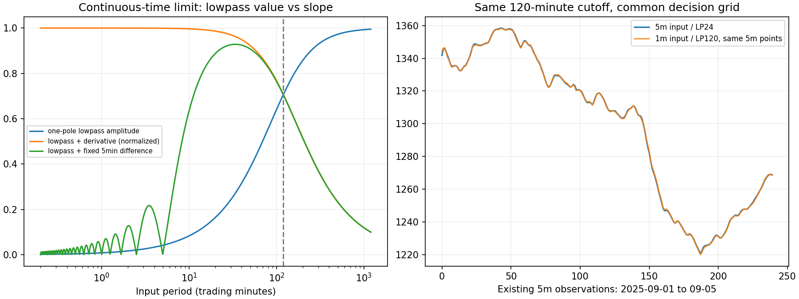

# 0.5交易日低通：应当用多细的K线？

结论：**不是比例越大、K线越细，交易就一定越好；也不能仅凭24倍就认定5分钟“太粗”。应把输入采样、斜率估计窗口、决策更新频率分开。当前有依据的研究起点是保留5分钟原版，同时比较“1分钟输入、120分钟低通、5分钟斜率与5分钟决策”；秒级不是已证明必需，更不是已证明最优。**

本课题以用户刚确认的0.5交易日=120交易分钟、一阶低通斜率反手版本为准，即5分钟输入时P=24。它不是此前LP12+波动率滞回版本。只做数学与2025信号层诊断，不做新策略收益/MDD排名，不继续旧A/B/C或回撤归因任务。2020—2024价格只供因果状态预热/延续；没有2026行情或秒级真实数据读取。

## 1. “120分钟截止周期”不等于“平均过去120分钟”

一阶低通的连续时间形式为：

`H(s)=1/(1+τs)，τ=120/(2π)≈19.10交易分钟`。

因此120分钟是频率响应的截止周期，不是一个120分钟等权平均窗口。Butterworth在截止频率仍保留约70.7%的幅度，更快的成分也并非全部清零。[SciPy官方定义](https://docs.scipy.org/doc/scipy/reference/generated/scipy.signal.butter.html)

从原代码对应的系数实际计算：

|输入间隔|每120分钟样本数R|单次孤立报价误差的首个输出权重|低频相位延迟离散偏差|
|---|---:|---:|---:|
|30分钟|4|50.00%|21.46%|
|15分钟|8|29.29%|5.19%|
|5分钟|24|11.63%|0.572%|
|1分钟|120|2.55%|0.0228%|
|15秒|480|0.650%|0.00143%|
|3秒|2400|0.131%|0.0000571%|
|1秒|7200|0.0436%|0.00000635%|

这里的偏差只衡量低频相位延迟相对连续一阶模型的离散化差异，不是全部滤波误差，更不是交易损失或最佳比例。它说明：**24倍已经不是明显粗糙的数值近似；从1分钟继续到秒级，在这一项上的改善迅速变小。** 但未解决的混叠、观测噪声和方向判别仍可能影响交易，不能据此说5分钟已完美。

所有采样间隔下，**纯120分钟正弦的滤波值相位延迟都为15交易分钟**，已用频率响应与实际正弦输入核对。采样更细不会把这个固有延迟消掉；这不是说每笔交易固定迟15分钟，实际转向还受波形、斜率估计和执行时点影响。

## 2. 本策略真正需要警惕的是“相邻点斜率”

原一阶数字低通满足：

`y_t = a*y_(t-1) + b*(x_t+x_(t-1))，a+2b=1，b>0`。

所以精确地有：

`y_t-y_(t-1) = b*[x_t+x_(t-1)-2*y_(t-1)]`。

这里x是原始对数价格、y是低通值，二者使用同一去初值坐标。**看相邻低通斜率的正负，等价于看最近两点原始对数价格的均值，在上一低通值上方还是下方。** 它并不意味着只在识别120分钟级的大趋势。

采样变细时b会变小，单点对低通“数值”的冲击变小；但策略只取斜率正负，乘一个更小的正系数并不能阻止符号翻转。价格贴着滤波线的小幅穿越，仍可能触发反手。本恒等式已在真实1分钟和5分钟输入上核验，最大数值残差约2.1e-16。

连续时间也能看到这个结构：低通后求导的传递函数为`s/(1+τs)`，高频幅度趋于常数，而不像低通值本身那样继续衰减。因此，**“曲线看起来平滑”和“它的斜率符号稳定”是两件事**。这是连续时间或充分过采样下的结构说明；离散系统在Nyquist附近有额外零点，不能将连续极限误套到所有离散频率。

如果1分钟输入仍看5分钟跨度的低通差，而不是相邻1分钟差，就保留了原来较长的斜率测量尺度。这也是为什么采样、斜率尺度、决策节拍必须分开。

## 3. 真实数据：固定120分钟后，变细没有自动减少反复

使用已封DataHub原生1分钟和5分钟数据，没有本地重采样造K线。在共同5分钟时刻，两路原始close完全一致；差别来自1分钟额外保留的中间价格路径。

2025全年结果如下。方向变化是**信号变化，不是已成交交易，也不是已证实假信号**。

|方案|输入|斜率跨度|决策更新|方向变化次数|≤10交易分钟就再次改变的完整方向片段比例|
|---|---|---|---|---:|---:|
|M5 原版|5分钟|5分钟|5分钟|1782|31.7%|
|M1_D5|1分钟|5分钟|5分钟|1988|37.0%|
|M1_H5_D1|1分钟|5分钟|1分钟|2340|39.9%|
|M1_H1_D1 直接逐点版|1分钟|1分钟|1分钟|3930|61.8%|

第一、二行只改变输入采样；第二、三行提高决策更新频率；第三、四行缩短斜率跨度。仅换细输入也多约11.6%的变化，若直接逐点搬到1分钟则超过原来两倍。不能把这些额外变化全部叫噪声，有些可能更及时地捕捉真实变化；但它已经否定“比例扩大必然减少反手”的简单推断。若逐次执行，潜在换手和成本还需另外核验。

在同一5分钟决策网格，两个滤波值的绝对差中位数仅1.13 log bp，方向一致率却只有93.77%。**曲线差很小，也足以让零门槛正负判断产生不同动作。** 1分钟不是不可见真实价格的真值参照，这个比较没有证明哪一路更赚钱。

用户关心的2025年4—9月也同向：四方案分别有963、1079、1275、2121次方向变化。之前绘图中的962个标记是下一开盘实际执行点，当前统计是窗口内收盘信号变化，边界口径不同，不是换了滤波策略。

右图取2025年9月1—5日作显示，两条低通曲线几乎重合。左图是连续时间频率响应示意，不是测得的市场秒级噪声谱。

## 4. 更细的数据能解决什么，不能解决什么？

能改善：保留5分钟内部路径、减少漏掉短变化的风险、让滤波数值更接近所选连续模型，并提供更早可用的观测。需要注意，价格不是天然带限信号；先取5分钟close再做低通，不等于采样前已经抗混叠，不能保证粗采样丢掉的信息都能补回来。[采样定理与混叠，作者原书](https://www.dspguide.com/ch3/2.htm)

不能保证：消除真实跳空、消除固定截止周期的因果响应滞后、让信号变化都更有价值，或自动降低交易成本。

“一笔错误报价只持续一个样本”和“真实冲击持续五分钟”不能混同。前者的单点权重会随细采样减小；后者在1分钟中是5个样本，在3秒中约100个样本，相同物理持续时间的影响不会因为拆成更多行就消失。

数据层与决策层的结论也不同。可靠、真正新增的细粒度数据值得保留，但不必每条都触发动作；若数据源几秒才更新一次，填成每秒一行不等于获得更多独立信息。指数还需核对真实更新、异步与陈旧值；不能把股票/ETF成交价中的买卖价弹跳直接当成当前指数噪声的已验证来源。

金融微观结构研究也区分这两层：忽略噪声时盲目提高采样频率可能有害，而建模噪声后使用更多观测可以更有效。这项经典论文研究的是波动率估计，并不提供我们策略的最佳秒数。[Aït-Sahalia、Mykland、Zhang，2005](https://www.princeton.edu/~yacine/sampling.pdf)

## 5. 当前应当在哪个级别开发？

建议的**研究起点**而非已验证收益最优解：

1. 保留原5分钟输入/5分钟决策作为对照；它不能仅因R=24被判定不合格。
2. 以已有1分钟数据计算同样120分钟低通，先保持5分钟斜率跨度与5分钟决策。这样能单独检验细输入的价值。
3. 秒级先作为可能的数据源，不直接绑定秒级斜率或秒级反手。只有真实观测质量、共同网格信号稳定性、费用后单笔质量和完整回撤显示增益，才有理由升级。

不存在跨市场、跨滤波器、跨噪声水平都通用的“最佳R”。合理R取决于允许的数值误差、采样前的高频内容、有效数据更新速度、斜率/方向测量尺度和执行成本。**真正应优化的是这套组合，而不是让两个周期的比例无限增大。**

本轮尚未比较这些方案的真实ETF/期权收益与MDD，也没有实测秒级数据，所以没有资格宣布1分钟或秒级是交易最优。只完成这个采样小课题，没有继续旧过滤或通道路由任务。

## 证据与复测

[数学响应](../../../artifacts/sampling_ratio_v1/response.csv)、[信号诊断及逐月表](../../../artifacts/sampling_ratio_v1/signal_diagnostics.csv)、[同网格一致性](../../../artifacts/sampling_ratio_v1/alignment.csv)、[斜率恒等式](../../../artifacts/sampling_ratio_v1/slope_identity.json)、[验证回执](../../../artifacts/sampling_ratio_v1/validation.json)。

代码：[研究执行器](../../../scripts/study_sampling_ratio_v1.py)；[四项专项测试](../../../tests/test_sampling_ratio.py)。原滤波器及旧封存工件未修改，使用现有原生行情、固定120分钟截止，前缀一致性与频率响应/实际正弦响应校验通过。状态：技术诊断完成，没有新的策略继任者或生产权限。
