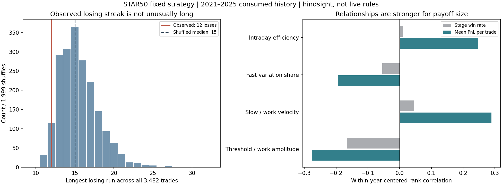

# 科创50第五轮结果：连败并不异常，规律主要体现在盈亏幅度

2026-09-06，Codex本地主控，任务`fl-wisxs`。这一轮已经完成，没有启动第六轮。

**判断：有可重复的后验价格—算法失配关系，但“连续失败很多，所以不是随机”的推断没有获得支持。当前更稳定的规律是频段关系改变每笔交易能赚到的幅度，而不是让胜率持续崩塌。**

全部结论只针对2021—2025已消费材料中的原始5m+0、LP12、sigma48/ddof0/k1、下一开盘、满仓多空、零费用signed-log指数账户。2020预热；2026价格、收益、属性读取为0。没有重新选参数、降低仓位、修改策略或声称可交易ETF收益。

## 1. 平均胜率只有38.40%，12连败不算异常长

本轮保留全部3,484个记账持仓片段，但胜率统计剔除区间首尾两笔尚不能视为完整交易的片段，得到 **3,482笔完整交易：1,337赢、2,145亏、0平，胜率38.397%**。平均赢一笔约93.34bp log收益，平均亏一笔约43.72bp，盈亏幅度比约2.135；若这两种条件均值固定，算术期望的盈亏平衡胜率约31.90%。这只是描述性分解，不是未来胜率保证。

因此“多数交易亏损”本来就是这个策略的常态。它依靠较少的较大盈利覆盖较多的小亏，不能拿50%当作合格胜率门槛。

| 结束年度 | 完整交易 | 胜率 | 最长连败 | 最差/最好50笔窗口胜率 |
|---|---:|---:|---:|---:|
| 2021 | 707 | 38.76% | 10 | 26% / 54% |
| 2022 | 684 | 37.72% | 11 | 24% / 54% |
| 2023 | 712 | 36.94% | 12 | 22% / 52% |
| 2024 | 680 | 39.56% | 11 | 24% / 54% |
| 2025 | 699 | 39.06% | 10 | 30% / 54% |

最长12连败发生于2023-02-23至02-28，损失约4.627% log。它既不是原策略最大回撤的完整窗口，也不是最长恢复期。少数大亏可以造成大回撤；多次小亏也可能形成长连败，两者不能互换。

冻结的三种随机对照各做1,999次：

| 随机对照保留什么 | 最长连败中位数 | 95%分位 | 至少出现实际12连败的参照p |
|---|---:|---:|---:|
| 保留各年精确胜/负数量，逐笔排列 | 15 | 20 | 0.9830 |
| 保留日内完整交易簇，排列交易日 | 14 | 19 | 0.9565 |
| 保留连续5交易日簇，排列这些簇 | 13 | 16 | 1.0000 |

第一行表示在这种参考模型下，约98.3%的排列出现至少同样长的连败，**不是“真实市场有98.3%概率随机”**。5日块本身会保留部分实际连败，所以对块内连败鉴别力有限，不能把p=1解释为证明完全随机。

全期最差20笔胜率10%，最差50笔22%，最差100笔27%；最好对应75%、54%、50%。这些窗口都经过全期、全位置、三窗口的同等扫描对照。最大胜率不足的未校正参照p为0.9770/0.9545/0.8900；最长连败、最长连胜、最大胜率不足和超额共12项一起Holm校正后均未拒绝对应原假设。

这说明**没有发现超出所检验随机参照的、更严重的连败或阶段胜率不足**。检验主要针对过长/过强聚集，不检验所有形式的非随机性，也不证明全部收益金额或市场路径随机。随机化保留/破坏什么必须明确；方法背景见[NIST游程检验](https://www.itl.nist.gov/div898/handbook/eda/section3/eda35d.htm)及[SciPy排列检验](https://docs.scipy.org/doc/scipy/reference/generated/scipy.stats.permutation_test.html)。

## 2. 连败之后，下一笔胜率没有持续降低

| 此前连续亏损 | 下一笔样本数 | 下一笔胜率 |
|---|---:|---:|
| 0笔（本样本中即上一笔赢） | 1,337 | 35.15% |
| 1笔 | 867 | 41.64% |
| 2笔 | 506 | 39.72% |
| 3—4笔 | 492 | 39.63% |
| 至少5笔 | 279 | 39.43% |

没有出现“越连败，下一笔越容易失败”的单调形态。最后一行仍略高于全样本38.40%。这些条件样本有依赖、较长连败会产生多个观察，表格没有单独作新的显著性检验；不能由此反向发明“连败后加仓”或断言存在可交易反转优势。

## 3. 频段规律存在，主要落在每笔收益而非胜率

按真实交易日历固定切成不重叠5日阶段，剔除双向滤波末端20日影响、不足5日及无完整结束交易的阶段，得到236个推断阶段。完整交易按结束日归属，其整笔收益不等于该日盯市收益。四个属性是在前四轮已知材料上预先固定的，不是本轮看到结果后扩充的指标。

| 后验属性 | 与阶段胜率ρ | 与平均每笔收益ρ | 每笔收益两种maxT修正p | 跨年方向 |
|---|---:|---:|---:|---|
| 日内路径效率 | +0.010 | +0.247 | 0.0010 / 0.0025 | 5/5年正 |
| <1小时快变化占比 | −0.055 | −0.194 | 0.0215 / 0.0285 | 5/5年负 |
| 慢变化/工作频段速度 | +0.046 | +0.289 | 0.0005 / 0.0010 | 5/5年正 |
| 滞回门槛/工作波幅 | −0.167 | −0.277 | 0.0005 / 0.0010 | 4/5年负 |

四个属性与胜率的关系，均未通过本轮8项共同修正；最接近的门槛/波幅项仍为0.0740/0.0725。它们与平均每笔收益的关系则都通过主图的两种保留时间结构参照。五个偏移总体方向一致；快变化占比在+2偏移修正后约0.0520/0.0505，略未通过，不能宣称每个偏移都显著。2025快占比/门槛项效应很弱，门槛对每笔收益还有微弱反号。

这比单看胜率更贴近机制：有净推进时，赢的那几笔能跑得更远；短往返强、工作波幅相对门槛不足时，有利位移较小，却仍承担固定反手系统的回吐和错位。

一个后验联合格能直观看出区别（阈值是全开发阶段中位数，仅用于描述）：

| 频段/门槛状态 | 阶段/交易数 | 交易加权胜率 | 平均每笔log收益 |
|---|---:|---:|---:|
| 慢/工作速度低，门槛/波幅高 | 64 / 926 | 37.80% | −0.24bp |
| 慢/工作速度高，门槛/波幅低 | 64 / 864 | 40.28% | +23.88bp |

胜率只差约2.48个百分点，平均每笔收益却差约24.13bp。相对较差那格仍有34/64个正收益阶段；较好那格仍有10/64个负收益阶段。它们是条件性质量差异，不是“进入就必亏/必赢”的标签。全部8个格子、交易分母及按时间最早的盈利/亏损反例见[分母与反例表](../../../artifacts/streak_mechanism_v1/condition_denominators_and_examples.csv)。

本轮未再检验前一日或盘中预测代理；这里的双向分量有未来，阶段中位数也不是实时门槛。拒绝同步错位不等于市场因果证明，共同价格来源、非正交分解、内生交易切分与年内非平稳都限制推断。

## 4. 无噪声波形证明“算法失配”可以系统性制造亏损

为区分“随机噪声”与“固定算法结构”，重新用可验证的原包执行器运行此前已固定的84个人工波形。算法、仓位、滞回门槛均不改；没有市场校准、交易费用或跳空。

| 单一正弦往返周期（按5分钟换算） | 完整片段胜率 | 对绝对价格路程的收益捕获率 |
|---|---:|---:|
| 30分钟（6棒） | 0% | −100% |
| 40分钟（8棒） | 0% | −100% |
| 60分钟（12棒） | 0% | −50% |
| 120分钟（24棒） | 100% | +25.9% |
| 240分钟（48棒） | 100% | +70.7% |

在60分钟纯波中，固定算法甚至连续1,279个完整片段都亏损。这里没有随机噪声，原因是固定滤波、滞回和执行延迟的联合响应与往返周期不匹配：等到反手，剩余的顺向路程不够，随后又走反向。

保持60分钟往返不变，叠加固定960棒慢波、慢/快最大速度比0.5、相位0，胜率只有约26.99%，捕获率却变为+6.90%；速度比2时，胜率约19.50%，捕获率约+90.02%。慢推进让少数盈利腿足够长，即使胜率不高也可覆盖损失。

这些是**固定算法失配机制存在的数学对照**，不是科创50真实价格生成机制的证明，也不是可实现收益率。捕获率不同于CAGR；纯波例子有意极端、不得迁移为真实阈值。实际最长连败只有12笔，不能用人工波形的数千连败反证实际市场必然处在长期单一失效状态。

## 本轮结论与边界

对“到底是巧合，还是有规律”的回答是：

- **实际连败长度与阶段胜率不足：没有超出声明的随机参考，不能据此判定存在特殊失效状态。**
- **价格频段与盈利质量：有重复的后验关系；更像是净推进/工作波幅能否覆盖固定反手响应和回吐的问题。**
- **确定性算法机制：存在；同一固定算法面对足够短的规则往返，就可以持续亏损。**
- **每次回撤的精确起止与全部真实市场因果责任：仍未闭合。** 本轮没有估计一个“多少百分比属于巧合”的概率，也没有得到可直接上线的规则。

与最初猜想相比，应保留“频段之间的关系有用”，但把主要观察量从“连续胜率”改成“平均每笔收益、盈利幅度相对亏损/回吐幅度”。这是下一次研究的线索，本轮没有据此展开新实验或修改策略。

## 来源、验证和复现

第五轮从原包Git可恢复的实际源码建立了**新的独立来源绑定**，没有采用第四轮无法找回的预期源码哈希，也没有修改第四轮协议或99项封存文件。第四轮历史源码缺口`fl-mmbk4`仍保留；本轮来源门通过不代表它已被修复。

58项完整测试通过。2021—2025逐年人工审阅、封存和摘要链通过；五个偏移的原持仓及逐根损益全部重建精确一致；15张随机序列矩阵重建逐项一致；阶段统计重放误差0；原基线年化86.756625%和MDD14.323805%的身份未变。全部研究继续是已消费历史，`fresh_oos=false`、`production_authority=false`，策略候选为0。

入口：[结果前方法](method.md)、[机器协议](protocol.json)、[工作流](workflow.md)、[严格核验](../../../artifacts/streak_mechanism_v1/validation.json)、[12项随机检验](../../../artifacts/streak_mechanism_v1/sequence_tests.csv)、[40行主图/偏移属性检验](../../../artifacts/streak_mechanism_v1/all_stage_tests.csv)、[84个人工波形](../../../artifacts/streak_mechanism_v1/synthetic_cases.csv)。源码、年度图件、完整表格与控制者收据均在本机，不依赖云端Actions。
