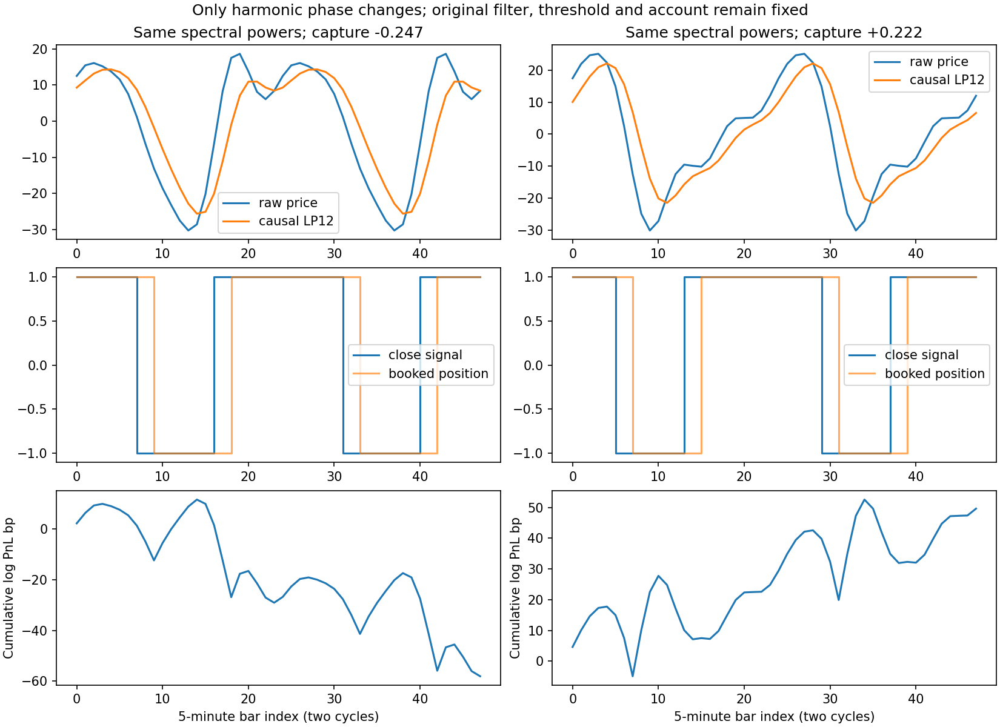
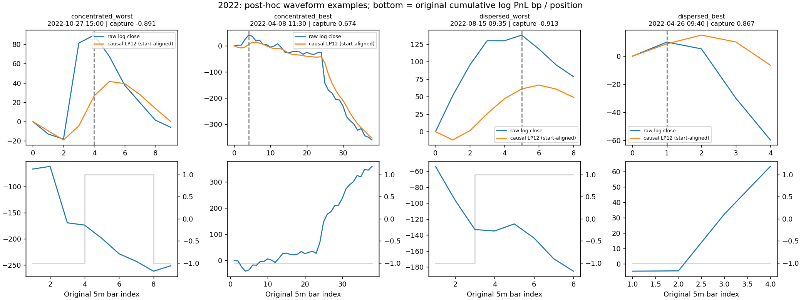

# 波形偏斜、急起急落：对用户猜想的验证

2026-09-06，本地执行。结论：**“急起急落、位移集中”得到部分支持；“右偏好、左偏坏”不能作为一般结论。真正有关的是一个周期内的位移如何排列，以及原价格转折与滤波信号转折的相对位置。** 同一频率配置，不保证同一形状或同一交易效果。

没有换策略、降仓位或更换账户。本轮真实行情损益只读原5m+0、多空满仓、零费用signed-log指数账户；没有新真实账户回测、ETF低资金占用实验或2026行情读取。以下是后验机制研究，不是可直接使用的实时否决规则，也没有把原最大回撤14.32%降下来。

## 一、先纠正滤波器的事实

当前源码是`butter_lowpass(log_close, period_bars=12, order=1)`：一阶低通，截止周期12根5分钟K线。不是只留下一个固定周期，也不是一个上下边界都封死的窄带。[源码](../../../src/star50_filter/filters.py)；Butterworth的截止点表示幅度增益降到约0.707，而非从此变成零。[SciPy官方说明](https://docs.scipy.org/doc/scipy/reference/generated/scipy.signal.butter.html)

从原系数实际计算出的幅度保留比例：

|输入周期|幅度保留|
|---|---:|
|20交易分钟（4根）|25.88%|
|40交易分钟（8根）|54.31%|
|60交易分钟（12根）|70.71%|
|120交易分钟（24根）|89.75%|
|240交易分钟（48根）|97.14%|

因此，较快成分被削弱但仍可能影响转折；原价格包含它们，交易也按原价格记账。5分钟采样不能唯一分辨不足10分钟的周期，不能把5分钟bar等同于5分钟完整波周期。完整[频率响应](../../../artifacts/wave_shape_v1p2/filter_response.csv)保留。

如果真的只有一个恒定频率的纯正弦，形状确实固定，没有可以独立变化的“左偏/右偏”。尖峰、非对称和多次小转折需要多个频率成分，或幅度/相位随时间变化。之前用“涨得不持续”概括而不说明这一点，是解释不充分。

## 二、先把“偏度”说准

统计学的右偏是尾巴向右，不等于峰在右侧。峰靠左的三角脉冲反而具有正的时间质量偏度。因此本轮不以模糊的左右名称替用户判定，而分开检验：

- 波峰在完整谷—谷周期中的位置；
- 用波形高度加权的时间偏度（不是收益率偏度）；
- 位移集中度：相同长度内，价格变化是否塞进少数K线；
- 半高宽：脉冲是否尖窄。它不是统计峰度，本轮没有据此宣称“峰度无效”。

## 三、同周期、同幅度，改变形状会不会从赚变亏？会

共90种冻结形状、每种5个采样起点，450例。全部保留原LP12、sigma48、k1和原执行器。下面的“捕获率”是策略log损益/价格绝对log路程，**不是账户回撤，也不是年化收益**。

### 1. 左右不对称本身不是统一的好坏方向

固定24根周期、0.002 log峰谷幅度的三角波：

|峰位置|形状|捕获率|
|---:|---|---:|
|1/8|极快升、慢落|-4.76%|
|1/4|快升、慢落|+16.67%|
|1/2|对称|+33.33%|
|3/4|慢升、快落|+16.67%|
|7/8|极慢升、快落|-4.76%|

这些左右镜像结果相同，48/96根周期下也成立。此族支持“极端不对称可能损害捕获”，不支持单凭左右符号定好坏。加入平段的孤立脉冲，左右位置可以产生不同结果，所以也不能把三角族的镜像相等推广成所有波形的定理。

### 2. 用户说的“直上直下”能造成确定性的两边亏

仍是24根总周期、相同峰谷幅度、对称脉冲：涨跌铺满24根时捕获率+33.33%；压缩到12根、其余平坦时约0；压缩到6根、其余平坦时-66.67%。

这里没有缩短总重复周期，也没有更换交易算法；改变的是同一周期中真正发生位移的部分。**行情的幅度在少数K线中先完成，滤波后的拐点与门槛确认落在后面，反手价格就可能落在不利的峰谷附近。** 这是可重复的结构性损失，不要求随机噪声。

但脉冲变窄会改变谐波强度，不能拿这一实验冒称“整个频谱也相同”。所以又做了下面更严格的对照。

### 3. 连各频率强度都相同，只改变相位，也能由赚转亏

固定四个成分的周期和振幅：24、12、8、6根，振幅比例1、0.5、0.25、0.125。只改变第二、第三成分的相位，其他不动。

24根基周期下，16种相位组合的捕获率从**-24.66%到+22.16%**。示例两组的幅频谱最大差只有6.18e-18，原sigma48门槛最大差2.17e-19；差异不是频率强度、波动门槛或仓位改出来的。峰谷幅度会随相位改变，所以这个对照不声称“峰谷幅度也相同”。



**相位的意思是几种波在时间上如何错开。** 同样的几种波，可以在某几根K线上同向叠加成陡坡，也可以彼此抵消，随后再叠加。滤波器对各频率的幅度和相位作用不同，合成后原价格转折与信号转折的位置关系就会改变；再经过有状态的反手门槛，最终交易结果不同。

这才回答“用相同尺子、相同频段为什么还能不一样”：不是尺子变了，而是**同样频率成分在周期内部的时间排列不同**。只看频率能量或一个偏度数，无法完整描述这种排列。

## 四、真实K线是否符合？最稳的是“位移集中度”，不是偏度的正负

2021→2025逐年独立准备材料并人工看图后，汇总3244个不重叠价格定义周期，覆盖各年98.35%—98.81%的原记账区间。周期由后验转折划分，不按盈亏挑选；边界与形状无定义部分的损益另列。真实净收益直接来自原已验收快照。

在每年控制周期长度、峰谷幅度、sigma和归一化净趋势后，统一8项关联检验；各1999次年内循环错位、20周期分块错位，用最大绝对统计量同时修正。

|形状量|与捕获率的控制后秩相关|两种修正后参照比例|进一步证据|
|---|---:|---|---|
|位移集中度|-0.0965|0.0005 / 0.0005|五年同向；严格相近条件匹配也五年同向|
|峰的时间位置|-0.0892|0.0005 / 0.0005|严格匹配只剩31对，重叠支持很弱，不据此推广左右好坏|
|时间质量偏度|-0.0770|0.0005 / 0.0010|匹配后平均捕获差仅-0.37个百分点，年度方向不稳|
|半高宽|-0.0228|0.6485 / 0.6560|未通过，不能用尖窄宽度一个数解释损失|

完整[关联表](../../../artifacts/wave_shape_v1p2/associations.csv)和[匹配结果](../../../artifacts/wave_shape_v1p2/matched_outcomes.csv)保留。错位参照仍有年内可交换性假设，不能解释成一般因果p值；相关强度也不大，不是确定性分类器。

### 与用户问题最直接对应的357对比较

匹配约束：同年，周期长度相差不超过25%、振幅不超过25%、sigma不超过50%、归一化净趋势差不超过0.25，无复用对照。比较位移集中度最高与最低四分位，得到357对：

|相近条件下|更集中在少数K线|较分散|
|---|---:|---:|
|平均捕获率|-10.24%|-2.99%|
|平均周期log损益|-10.11 bp|+3.87 bp|
|亏损周期占比|56.86%|49.58%|

集中组平均捕获率低7.25个百分点，平均周期log损益低13.98bp，五年分别都更差。这是用户“行情起得急会伤害该系统”的条件性证据。但集中组仍有约43%的周期不亏，分散组也有大量亏损，不能说“亏钱的都是它”。周期不是完整交易，以上不能冒称单笔交易质量改善或账户MDD下降。

不控制周期、振幅和趋势时，高集中度桶并不普遍更差，有些年反而收益更高。故这是**相近条件下的关联**，不能直接写成“只要急动就不参与”的无条件否决规则。

## 五、同样急动，为什么有的亏、有的赚？真实反例

2022年的高集中度亏损例从10月27日尾盘延续到28日，正处14.32%最大回撤阶段：价格急冲时原系统仍为空头，随后才反多，价格又回落。周期捕获率-89.06%，符合“先急动、后确认、再折返”的机制。

但4月8日起的高集中度下行例，后半段急跌发生时原系统已经持有空头，捕获率+67.4%。**急动没有自动变成亏损；要看急动落在原滤波状态和持仓反手的哪一侧。** 2021、2023、2024、2025的逐年图都保留类似盈利反例及“不特别集中也亏”的反例。



图中的案例是事后挑出用于展示反例，不是独立显著性证明，也不是完全匹配的两条行情。实际严格匹配在该最大回撤附近有3对：10月27日集中波比对照更差，11月3日集中波反而少亏，11月4日差异很小。不能把总体关联硬套到每一笔，或宣称已解释14.32%回撤中的某个百分比。

## 六、目前可以说清的原因和仍不能说的结论

有支持的机制是：**同一周期内，位移集中在少数K线；多频成分的相位叠加形成陡坡/急折返；原有滤波状态使确认发生在较大位移之后，反手又承受随后回摆。** 相同急动若出现在已经持有正确方向之后，则可能成为盈利来源。需要的是波形与滤波历史状态的组合，而非仅看波形左右偏。

它不是全部原因：隔夜跳变、原有持仓状态、净趋势、离散采样、门槛记忆都仍参与；本轮并未把它们各自的真实市场贡献做互斥因果分解。谷—谷划分与时间偏度使用未来数据，不能盘中直接计算来交易；下一步若设计筛选，必须另做当时可得版本，并回到原策略同仓位完整路径比较。本轮未创建任何新筛选条件。

因此判定为：**用户猜想部分得到支持；签名式“左偏坏、右偏好”不足以成立；存在明确的波形/相位失配机制，但尚无实时交易规则或新策略继任者。**

## 验证、事故与复现

原始滤波/执行源码及行情快照SHA通过。78项测试通过；五年周期表独立重算字节一致，五份主控图审摘要链通过；450个合成例在两个进程中的4个结果文件字节一致；两套1999次错位数组重新计算完全一致。见[验收回执](../../../artifacts/wave_shape_v1p2/validation.json)。

两项研究实现问题已保留并修复，不覆盖旧封存：v1窄脉冲峰落在采样点之间导致实际振幅不完全相同，改为对实际采样峰归一化；v1p1的2021图审发现收盘形状端点与开盘账户收益错开一根，v1p2按close[a]/close[c]对应next-open[a+1]/next-open[c+1]映射，只更正诊断窗口，不改原订单和收益。旧源码、旧结果和事故记录均保留，当前报告只引用v1p2历史结果。没有根据结果扩展形状家族或调阈值。

方法、执行器、测试和报告入口：

- [结果前方法及时间修正](method.md)
- [冻结执行器](../../../scripts/run_wave_shape_v1.py)、[测量模块](../../../src/star50_filter/wave_shape.py)、[测试](../../../tests/test_wave_shape.py)
- [报告与只读重算校验](../../../scripts/report_wave_shape_v1.py)

在独立STAR50仓库根目录执行：

```bash
"/home/starryocean/桌面/量化/baylum terminal 0.4.1/factor_lab/.venv/bin/python" scripts/report_wave_shape_v1.py
```

此命令重算诊断和既有合成示例，不重跑真实账户、不优化策略。原先对第4轮源码的历史缺口保持原状态，本轮引用的是第5轮重新绑定并验收的原始账户快照。
